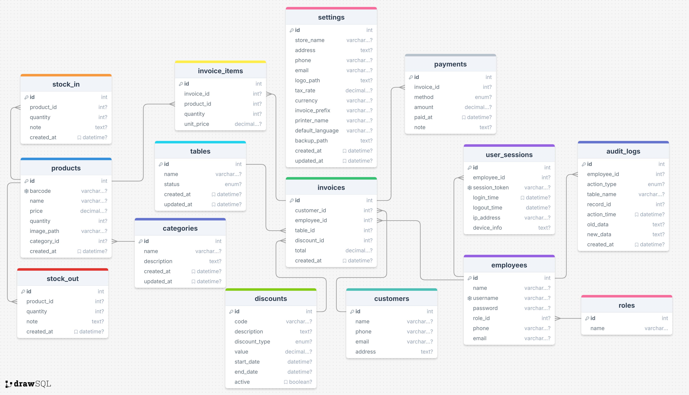

# 🛒 POS_App – Point of Sale Management Application

[](./README.md) [](./README_EN.md)  


A comprehensive sales management application developed in **Java Swing**, following the **MVC + UI Layered** architecture. Fully supports features like product, invoice, customer, inventory, and employee management. Modern, user-friendly, and extensible interface.

---

## 🧰 Technologies & Development Environment

| 🔧 Component        | ⚙️ Details                                        |
| ------------------- | ------------------------------------------------- |
| 🖥️ **Language**     | Java 24                                           |
| 🧠 **IDE**          | NetBeans 25 (Apache NetBeans)                     |
| 🎨 **UI Toolkit**   | Java Swing + FlatLaf                              |
| 🗃️ **Database**     | MySQL + JDBC (mysql-connector-j)                  |
| 🧩 **Architecture** | DAO – Model – View – Component Separation (MVC++) |
| 🖌️ **Theme**        | FlatLaf Light                                     |

---

## 💻 System Requirements

- ☕ Java JDK 17 or higher (Java 21+ recommended)
- 💡 NetBeans 15+ or IntelliJ with Swing support
- 🛢️ MySQL Server 5.7+ or 8.x
- 🧑‍💻 Compatible with Windows / macOS / Linux

---

## 📁 Project Structure

```bash
pos_app/
├── dao/              # Data access layer (Database Access)
├── icons/            # UI icons (SVG/PNG)
├── models/           # Data models: Product, Invoice, Customer, ...
├── pictures/         # Static images for UI
├── sql/              # SQL files (schema & data)
├── ui.components/    # Reusable UI components: Button, Sidebar, Header,...
├── ui.dialog/        # Forms for data input/edit
├── ui.panel/         # Feature panels: Products, Invoices...
├── ui.table/         # Custom table renderers/editors
├── util/             # Utilities: DBConnection, IconUtil, ...
├── view/             # Main application frame (MainFrame.java)
└── test/             # Unit tests
```

---

## 📦 Dependencies

| 📚 Library                                 | 📝 Description                                               |
| ------------------------------------------ | ------------------------------------------------------------ |
| `FlatLaf`                                  | Modern look and feel, SVG support, IntelliJ/Dark mode        |
| `flatlaf-extras`                           | Easy theme/icon customization from SVG                       |
| `darklaf-core`                             | (Optional) Shadow, blur effects                              |
| `darklaf-utils`, `darklaf-property-loader` | Darklaf config utilities                                     |
| `mysql-connector-j`                        | MySQL JDBC connector                                         |
| `protobuf-java`                            | Fallback for binary data storage                             |
| `jsvg`                                     | Display SVG icons in UI                                      |
| `java-se` (`core-3.5.3`, `javase-3.5.3`)   | Image/webcam/barcode processing                              |
| `webcam-capture`                           | Webcam integration for scanning QR/barcodes or taking photos |
| `slf4j-api`, `slf4j-simple`                | Simple system logging                                        |
| `bridj`                                    | Native Windows call for webcam                               |
| `gson`                                     | Convert between JSON and Java objects                        |

---

## 🖥️ Main Features

| 🧩 Feature                | 📌 Description                                                   |
| ------------------------- | ---------------------------------------------------------------- |
| 🛒 **Sales (POS)**        | POS UI, cart management, payment processing, invoice printing    |
| 📦 **Product Management** | CRUD products, update quantity/price/status, category management |
| 👤 **Customer**           | Manage customer info and grouping                                |
| 🧾 **Invoice**            | List, search, view and print invoices                            |
| 📊 **Statistics**         | Sales summary with Pie/Bar charts _(in progress)_                |
| 🚚 **Stock In/Out**       | Track inventory, create stock-in and stock-out slips             |
| 👔 **Employees/Roles**    | Manage accounts, assign roles (Admin, Staff)                     |
| 📋 **Dashboard**          | Aggregate system update logs from POS machines                   |
| ⚙️ **System Settings**    | Configure theme, store info, currency, etc.                      |

---

## ✅ Getting Started

1. **Clone the repository:**

   ```bash
   git clone https://github.com/dangkhoa2004/pos_app.git
   ```

2. **Open with IDE:**  
   👉 Preferably NetBeans 25 or IntelliJ (pre-configured with Maven/Ant)

3. **Setup MySQL database:**

   ```sql
   CREATE DATABASE pos_app CHARACTER SET utf8mb4 COLLATE utf8mb4_unicode_ci;
   ```

   Then import `pos_app.sql` from the `/sql` folder.

4. **Configure DB in `DBConnection.java`:**

   ```java
   private static final String URL = "jdbc:mysql://localhost:3306/pos_app";
   private static final String USER = "root";
   private static final String PASSWORD = ""; // Change to your password
   ```

5. **Run `MainFrame.java`** to launch the application.

6. **Notes:**
   - Add JDBC driver if `ClassNotFoundException` occurs
   - Use UTF-8 for proper Vietnamese character display

---

## 📌 Development Notes

- All icons are in `icons/` as scalable SVGs
- To add new feature → Create `Panel` in `ui.panel` → Register via `SideBarMenu`
- Under-construction features will show a `JOptionPane` message
- The project is extensible: PDF invoice, cloud sync, etc. ready for integration

---

## 📸 UI Screenshots

### 🌙 FlatLaf Dark Mode

> ⏳ _Coming soon_

<!--  -->

### ☀️ FlatLaf Light Mode

> ⏳ _Coming soon_

<!--  -->

---

## 🔮 Roadmap

- [ ] 🧾 Export invoice to PDF
- [ ] 📤 Google Sheets API integration
- [ ] 💾 Scheduled automatic backups
- [ ] 🔐 Advanced login & permission system
- [ ] ☁️ Firebase cloud sync (optional)

---

## 🤝 Contributing

We welcome contributions to improve this project!

- 🛠 Fork the repo
- 🌱 Create a branch: `feature/<feature-name>`
- 📥 Submit a detailed Pull Request

---

## 📚 Technical Docs

- 🧩 **DB Schema & Sample Data:**

  ```sql
  CREATE DATABASE IF NOT EXISTS pos_app;
  USE pos_app;

  CREATE TABLE roles (
      id INT AUTO_INCREMENT PRIMARY KEY,
      name VARCHAR(50) NOT NULL
  );

  CREATE TABLE employees (
      id INT AUTO_INCREMENT PRIMARY KEY,
      name VARCHAR(100),
      username VARCHAR(50) UNIQUE,
      password VARCHAR(255),
      role_id INT,
      FOREIGN KEY (role_id) REFERENCES roles(id)
  );

  ... ... ...
  ```

[View full SQL file](./src/pos_app/sql/pos_app.sql)

- 🧩 **ER Diagram:**

  

- 📦 **How to create new module:** _(coming soon in Wiki)_

---

## 📜 License

This project is currently **not published under an open license**.  
Please contact the author for permission if you'd like to use or redistribute the code.

---

## 👤 Author & Contact

- 👨‍💻 **Author:** Đăng Khoa
- 📧 **Email:** 04dkhoa04@gmail.com
- 💬 **Facebook:** [Đăng Khoa](https://www.facebook.com/dangkh0a2004)
- ⭐ If you like this project, give it a star!
